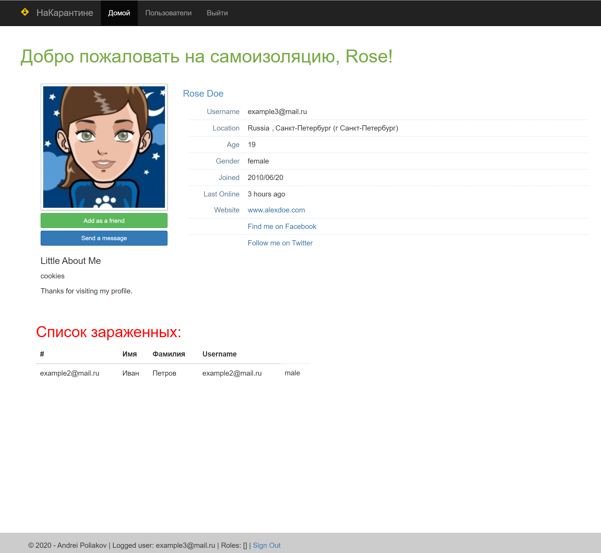

# Социальная сеть "НаКарантине"

Live demo: https://polyakov-a-social-network.herokuapp.com

## ТЗ (часть 1):
**Заготовка для социальной сети**

**Цель:** В результате выполнения ДЗ вы создадите базовый скелет социальной сети, который будет развиваться в дальнейших ДЗ. В данном задании тренируются навыки: - декомпозиции предметной области; - построения элементарной архитектуры проекта
Требуется разработать создание и просмотр анект в социальной сети.

**Функциональные требования:**
- Авторизация по паролю.
- Страница регистрации, где указывается следующая информация:
    1) Имя
    2) Фамилия
    3) Возраст
    4) Пол
    5) Интересы
    6) Город
- Страницы с анкетой.

**Нефункциональные требования:**
- Любой язык программирования
- В качестве базы данных использовать MySQL
- Не использовать ORM
- Программа должна представлять из себя монолитное приложение.
- Не рекомендуется использовать следующие технологии:
    1) Репликация
    2) Шардинг
    3) Индексы
    4) Кэширование

Верстка не важна. Подойдет самая примитивная.

Разместить приложение на любом хостинге. Например, heroku.

**Требования:**

- Есть возможность регистрации, создавать персональные страницы, возможность подружиться, список друзей.
- Отсутствуют SQL-инъекции.
- Пароль хранится безопасно.

## ТЗ (часть 2):
**Производительность индеков**

**Цель:** В результате выполнения ДЗ вы создадите набор тестовых данных для проведения нагрузочного тестирования, подберете наиболее подходящие индексы и проведете тесты производительности. В данном задании тренируются навыки: - генерация тестовых данных; - работа с индексами; - нагрузочное тестирование;
1) Сгенерировать любым способ 1,000,000 анкет. Имена и Фамилии должны быть реальными (чтобы учитывать селективность индекса)
2) Реализовать функционал поиска анкет по префиксу имени и фамилии (одновременно) в вашей социальной сети (запрос в форме firstName LIKE ? and secondName LIKE ?). Сортировать вывод по id анкеты. Использовать InnoDB движок.
3) С помощью wrk провести нагрузочные тесты по этой странице. Поиграть с количеством одновременных запросов. 1/10/100/1000.
4) Построить графики и сохранить их в отчет
5) Сделать подходящий индекс.
6) Повторить пункт 3 и 4.
7) В качестве результата предоставить отчет в котором должны быть:
    - графики latency до индекса;
    - графики throughput до индекса;
    - графики latency после индекса;
    - графики throughput после индекса;
    - запрос добавления индекса;
    - explain запросов после индекса;
    - объяснение почему индекс именно такой;
    
**Требования:**

- Правильно выбраны индексы.
- Нагрузочное тестирование проведено и результаты адекватны.

## ТЗ (часть 3):
**настройка репликации**

**Цель:** В результате выполнения ДЗ вы настроите репликацию и протестируете ее влияние на производительность системы. В данном задании тренируются навыки: - администрирование MySQL; - настройка репликации; - проведение нагрузочных тестов;
1) Настраиваем асинхронную репликацию.
2) Выбираем 2 любых запроса на чтения (в идеале самых частых и тяжелых по логике работы сайта) и переносим их на чтение со слейва.
3) Делаем нагрузочный тест по странице, которую перевели на слейв до и после репликации. Замеряем нагрузку мастера (CPU, la, disc usage, memory usage).
4) ОПЦИОНАЛЬНО: в качестве конфига, который хранит IP реплики сделать массив для легкого добавления реплики. Это не самый правильный способ балансирования нагрузки. Поэтому опционально.

**Требования:**

- В отчете корректно описано, как настроена репликация.
- 2 запроса переведено на чтение со слейва.
- Нагрузочное тестирование показало, что нагрузка перешла на слейв.

## ТЗ (часть 4):
**Масштабируемая подсистема диалогов**

**Цель:** В результате выполнения ДЗ вы создадите базовый скелет микросервиса, который будет развиваться в дальнейших ДЗ. В данном задании тренируются навыки: - декомпозиции предметной области; - построения элементарной архитектуры проекта"
          Необходимо написать систему диалогов между пользователями. Обеспечить горизонтальное масштабирование хранилищ на запись с помощью шардинга. 
          
Предусмотреть:
- Возможность решардинга
- “Эффект Леди Гаги” (один пользователь пишет сильно больше среднего)
- Наиболее эффективную схему.

**Требования:**

- Верно выбран ключ шардирования с учетом "эффекта Леди Гаги"
- В отчете описан процесс решардинга без даунтайма

## ТЗ (часть 5):
**Лента новостей социальной сети**

**Цель:** В результате выполнения ДЗ вы создадите ленту новостей социальной сети В данном задании тренируются навыки: - работа с кешами; - работа с очередями; - проектирование масштабируемых архитектур.
          
Разработать ленту новостей. 
Создается отдельная страница, куда пишутся все обновления друзей. Для этого нужно хранить подписчиков. 
Лента формируется на уровне кешей. Формирование ленты производить через постановку задачи в очередь на часть подписчиков, чтобы избежать эффекта леди Гаги. 
В ленте держать последние 1000 обновлений друзей. Лента должна кешироваться.

**Требования:**

- Верно работает инвалидация кеша.
- Обновление лент работает через очередь.
- Есть возможность перестройки кешей из СУБД.