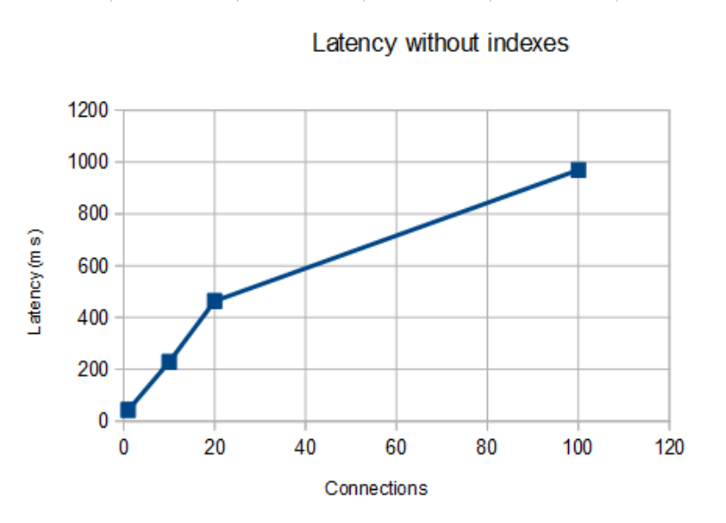
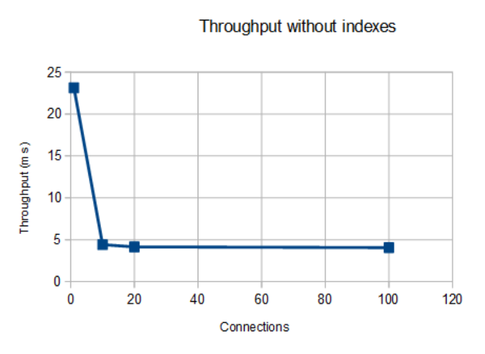
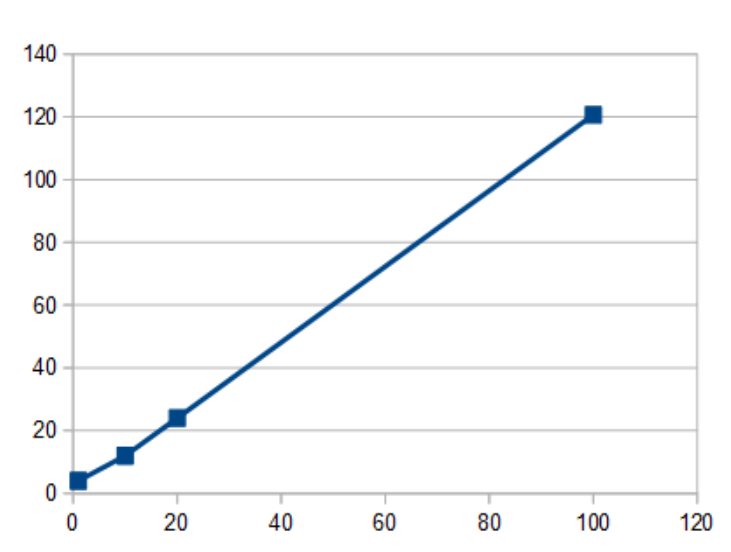

##Отчет по индексам:

### Исходные данные:

**1 000 000 записей** с реалистичным распределением имен 
(фамилии генерировались из одного датасета с именами - в дальнейшем это будет доработано). 
Все пользователи имеют случайно сгенерированные пол, возраст, интересы, а также город проживания (в качестве города взята база реальных стран).

Генератор тестовых данных (также наполняет БД с помощью сгенерированных sql-скриптов) находится по ссылке: [здесь](/data-generator).

### Оптимизация:

Анализатор для запроса 
```sql
select * from social_network.users
where first_name LIKE 'An%' and second_name LIKE 'Ve%'
order by id;
```

Результат выполнения `explain format=json`:
```json
{
  "query_block": {
    "select_id": 1,
    "cost_info": {
      "query_cost": "10352.25"
    },
    "ordering_operation": {
      "using_filesort": false,
      "table": {
        "table_name": "users",
        "access_type": "index",
        "key": "PRIMARY",
        "used_key_parts": [
          "id"
        ],
        "key_length": "8",
        "rows_examined_per_scan": 96870,
        "rows_produced_per_join": 1195,
        "filtered": "1.23",
        "cost_info": {
          "read_cost": "10232.68",
          "eval_cost": "119.57",
          "prefix_cost": "10352.25",
          "data_read_per_join": "7M"
        },
        "used_columns": [
          "id",
          "login",
          "password",
          "first_name",
          "second_name",
          "sex",
          "age",
          "interests",
          "city"
        ],
        "attached_condition": "((`social_network`.`users`.`first_name` like 'An%') and (`social_network`.`users`.`second_name` like 'E%'))"
      }
    }
  }
}
```

Были добавлены 3 индекса:

```sql
create index first_second_name_idx on social_network.users(first_name, second_name);
create index first_name_idx on social_network.users(first_name);
create index second_name_idx on social_network.users(second_name);
```

в explain выбирает индекс `first_second_name_idx`.
Данный индекс считаю достаточным, так как он покрывает оба поля, по которым выполняется условие **where** (**first_name** и **second_name**).

Результат выполнения `explain format=json`:

```json
{
  "query_block": {
    "select_id": 1,
    "cost_info": {
      "query_cost": "1373.85"
    },
    "ordering_operation": {
      "using_filesort": true,
      "cost_info": {
        "sort_cost": "222.94"
      },
      "table": {
        "table_name": "users",
        "access_type": "range",
        "possible_keys": [
          "first_second_name_idx",
          "first_name_idx",
          "second_name_idx"
        ],
        "key": "first_second_name_idx",
        "used_key_parts": [
          "first_name"
        ],
        "key_length": "804",
        "rows_examined_per_scan": 2557,
        "rows_produced_per_join": 222,
        "filtered": "8.72",
        "index_condition": "((`social_network`.`users`.`first_name` like 'An%') and (`social_network`.`users`.`second_name` like 'E%'))",
        "cost_info": {
          "read_cost": "1128.62",
          "eval_cost": "22.29",
          "prefix_cost": "1150.91",
          "data_read_per_join": "1M"
        },
        "used_columns": [
          "id",
          "login",
          "password",
          "first_name",
          "second_name",
          "sex",
          "age",
          "interests",
          "city"
        ]
      }
    }
  }
}
```

### Результаты нагрузки:

Без индексов cost выполнения запроса по оценке оптимизатора составил **10352.25**.

По предварительной оценке оптимизатора с выбранным индексом cost-ы запроса составят **1373.85**.

По результатам нагрузки получены следующие результаты:

1. Без индексов:

   
   
   
2. С индексом `first_second_name_idx`:

   
   
   
   
### Рефлексия (todo):

Что можно улучшить?

- Скорректировать датасет. Основной нюанс (и почему это важно), на реальных данных селективность имени и фамилии, как правило, разная. 
Поэтому работа с индексом (first_name, last_name) и (last_name, first_name) будет разной по эффективности.

- Сравнить explain запросов по отдельным индексам явно, а также сравнить разницу между последовательностью столбцов в индексе. 
Ну и также построить графики latency и throughput по всем замерам.