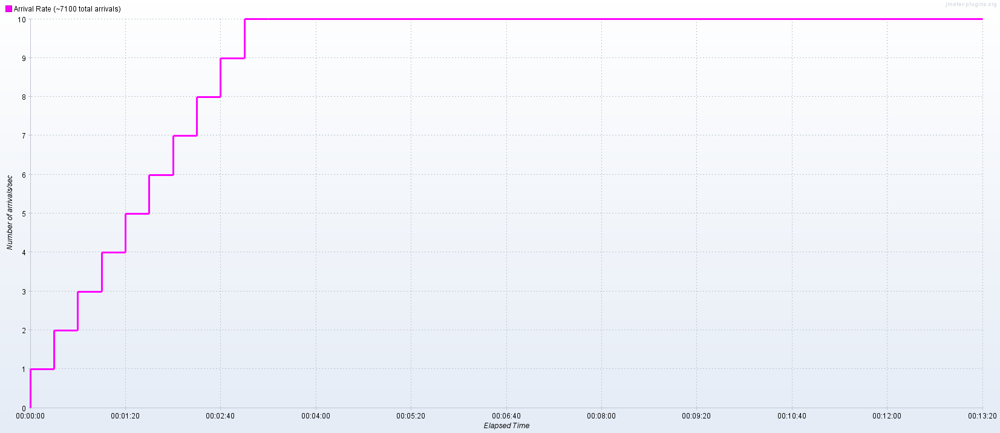
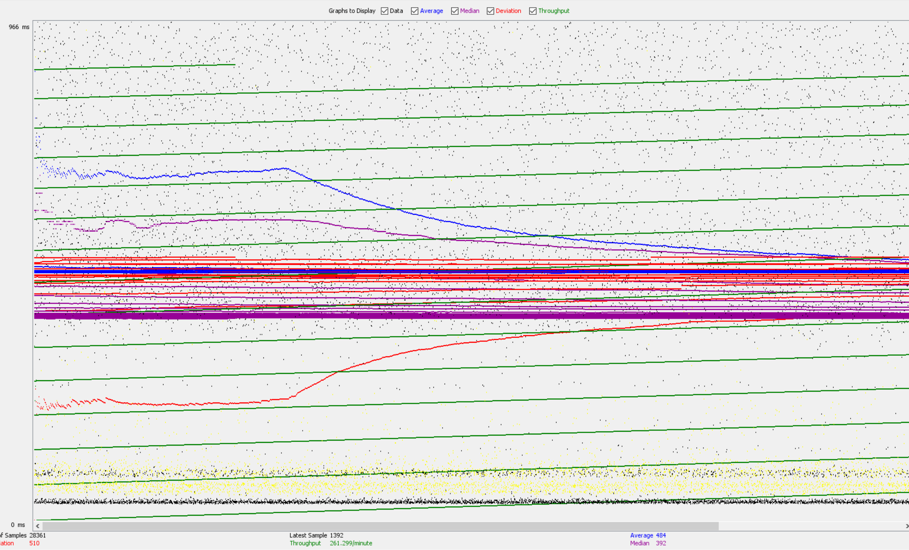
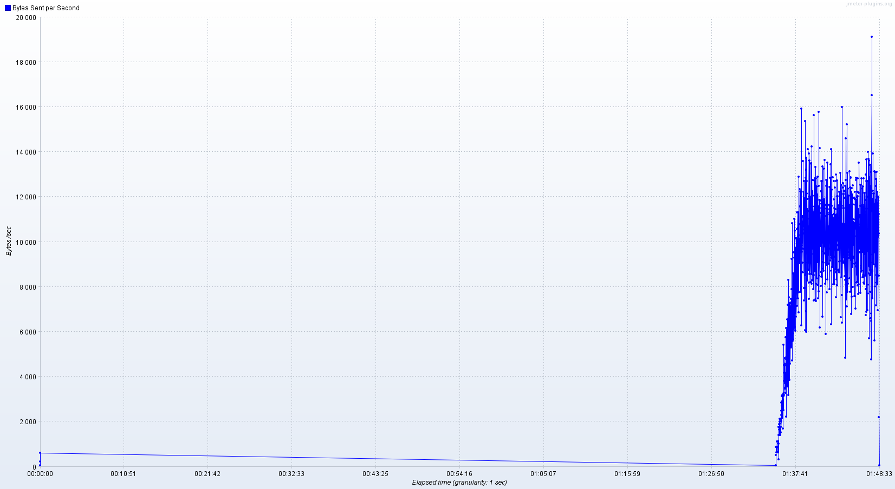
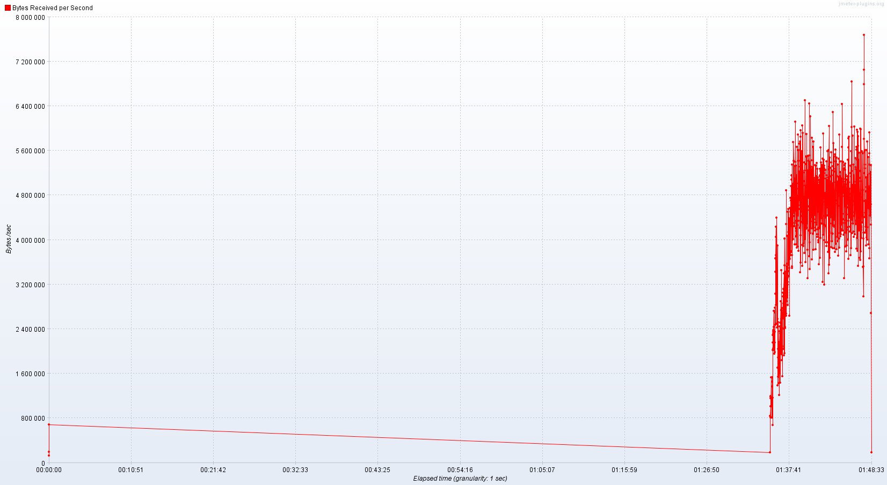
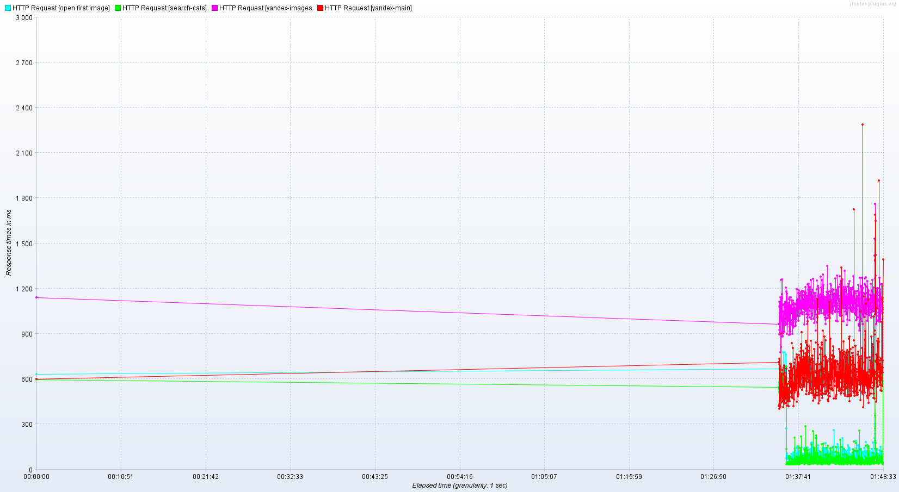
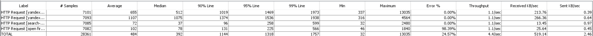

# Нагрузка Яндекса!

## ТЗ:
**Цель**: Разработает тестовый скрипт нагрузочного тестирования, проведет тестирование, проанализирует результаты.
1. По полученным навыкам на вебинаре - разработайте скрипт работы с сайтом яндекса:
    - переход на главную страницу
    - переход в раздел картинок
    - поиск картинки "котики" (или любой другой)
    - переход на найденному url из ответа системы
2. Проведите нагрузочный тест в несколько потоков в течение не менее 10 минут
3. Проанализируйте полученный результат и дайте ответ на вопрос - какие выводы можно сделать по результатам? Оформите выводы в виде краткого отчета

## Отчет:
Для проведения нагрузки был выбран инструмент JMeter. В качестве параметров нагрузки были выбраны следующие:
1. 10 arrivals/sec
2. Время прогрева (увеличения интенсивности): 200 секунд
3. Во время прогрева нагрузка увеличивалась за 10 шагов (с интервалом 20 секунд)
4. Нагрузка выполнялась в течение 10 минут после прогрева.

 

**Выводы:**

1. При интенсивной нагрузке (когда нагрузка становится 4 запроса в секунду), **у яндекса срабатывает механизм 
защиты от автоматического поиска ботами** - все запросы на поиск редиректятся на капчу. Обойти это ограничение
не получилось (на stackoverflow предлагается вариант с ручным вводом капчи, но тогда смысл нагрузки теряется).
При этом запросы на поиск успешно доходят до яндекса и успешно переходят на страницу с капчей - 
**яндекс отвечает стабильно на все одновременные запросы с нашей стороны**.
2. Средняя **пропускная способность** моего интернет канала: **262 запроса/минуту** (яндекс скорее всего выдерживает
намного больше, но проверить это в связи с ограничением канала не получилось).

(вообще из этого графика кроме пропускной способности сложно что-то понять)
3. По графику видно, что кол-во отправленных и полученных данных упирается в пропускную способность интернет-канала:
    - Для отправляемых запросов: примерно 10 000 - 12 000 байт/с
    
    - Для получаемых данных: 4 800 000 байт/с
    

4. Время ожидания ответа до увеличения кол-ва потоков до 4 (первые 1м 20с) постепенно росло, но после данного порога,
начинает прыгать, вести себя нестабильно.

5. **Сводная таблица**:

    - пропускная способность: 4 запроса в секунду
    - перцентиль 90%: 1144
    - всего передано запросов: 28361
    - запросы на переходы на страницы яндекса и яндекс-картинок все прошли успешно - у яндекса нет защиты от ботов для них.
    Запросы на поиск картинок начиная с четырех одновременных начали перенаправляться на капчу, поэтому большая часть запросов
    на получение и открытие первой картинки из поисковой выдачи не прошли.