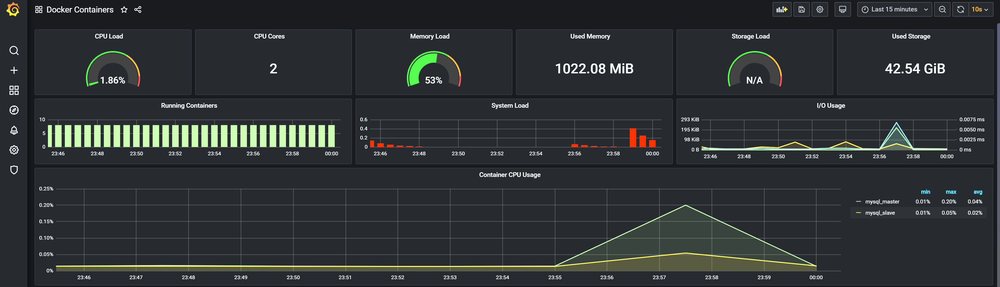
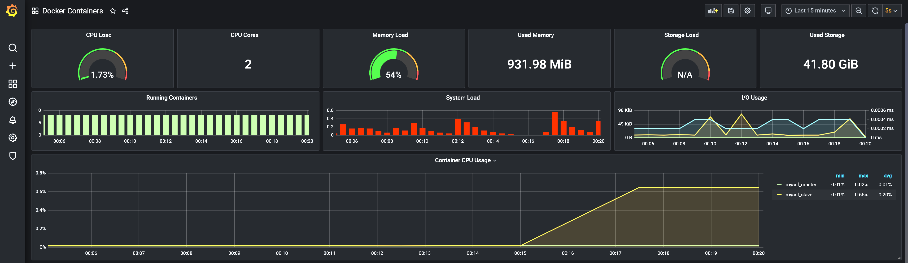

## Отчет по репликации:

### Предварительная настройка:
Исходные файлы для настройки асинхронной репликации mysql взяты отсюда: https://github.com/vbabak/docker-mysql-master-slave

Поднимается один master узел и один slave узла (настройка выполнялась по руководству [README.md](./README.md).

Нагрузка на кластер мониторится с помощью prometheus+grafana отсюда:
- [Docker Compose файлы](https://github.com/stefanprodan/dockprom)
- [Дашборды для Grafana](https://grafana.com/grafana/dashboards/893)

При настройке сервиса социальной сети на использование репликации были рассмотрены несколько вариантов:
- Использование [MaxScale](https://github.com/mariadb-corporation/MaxScale) и
 [MySql Replication JDBC Driver](http://dev.mysql.com/doc/connector-j/en/connector-j-master-slave-replication-connection.html)
- Использование Database Proxy server like [MySQL Proxy](http://dev.mysql.com/doc/mysql-proxy/en/)
- Использование Replication DataSource: [kwon37xi/replication-datasource-boot](https://github.com/kwon37xi/replication-datasource-boot).

Был выбран последний вариант: написан `ReplicationRoutingDataSource`, который выбирает использовать master или slave в зависимости от типа транзакции.

Данное решение работает с [TransactionSynchronizationManager](http://docs.spring.io/spring-framework/docs/current/javadoc-api/org/springframework/transaction/support/TransactionSynchronizationManager.html).

При использовании [Spring framework](http://spring.io/) достаточно установить `@Transactional(readOnly = true|false)`.

### Результаты:
В качестве нагрузки использовался скрипт для JMeter, который слал http-запросы на rest api сервиса социальной сети
(запросы на поиск пользователей и на получение списка пользователей).

Исходная нагрузка на mysql (были выполнены insert-ы в базу данных): видна небольшая загрузка CPU master-ом.

Нагрузка на чтение перешла на slave: CPU нагружен slave-ом существенно больше, чем master-ом
