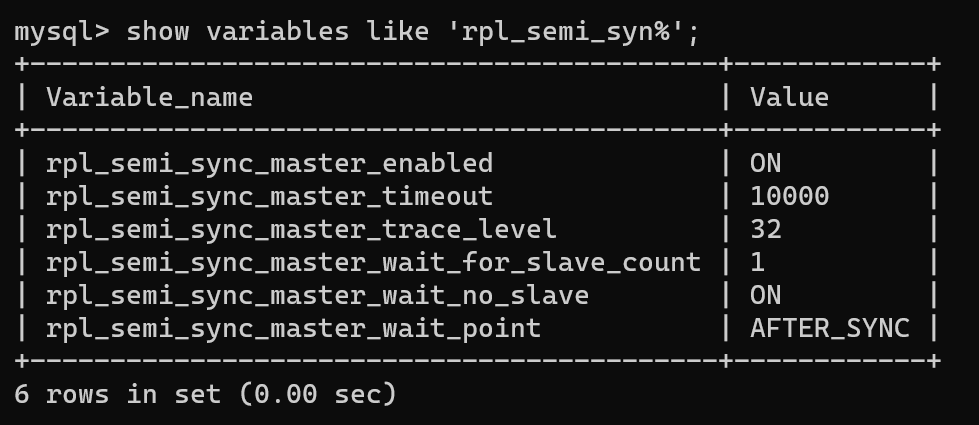

## Отчет по полу-синхронной репликации:

## ТЗ (часть 3):
**настройка репликации**

**Цель:** В результате выполнения ДЗ вы настроите полусинхронную репликацию и убедитесь, что теперь вы не теряете транзакции в случае аварии. 

В данном задании тренируются навыки: 
- обеспечение отказоустойчивости проекта; 
- администрирование MySQL.

Инструкция:
1) Настроить 2 слейва и 1 мастер.
2) Включить row-based репликацию.
3) Включить GTID.
4) Настроить полусинхронную репликацию.
5) Создать нагрузку на запись в любую тестовую таблицу. На стороне, которой нагружаем считать, сколько строк мы успешно записали.
6) С помощью kill -9 убиваем мастер MySQL.
7) Заканчиваем нагрузку на запись.
8) Выбираем самый свежий слейв. Промоутим его до мастера. Переключаем на него второй слейв.
9) Проверяем, есть ли потери транзакций.

**Требования:**

- В отчете корректно описано, как настроена репликация.
- 2 запроса переведено на чтение со слейва.
- Нагрузочное тестирование показало, что нагрузка перешла на слейв.

### Предварительная настройка:

Для запуска mysql использовались докер-образы, описанные в отчете по предыдущему ДЗ [replication01.md](replication01.md).
Был настроен 1 slave вместо 2-х (на настройку второго slave-а не хватило времени), но это вроде не должно повлиять на результат проверки по потере транзакций.

Были включены **row-based репликация** и **GTID** через настройки **my.cnf**:

```properties
binlog_format = ROW
gtid_mode=ON
```

Использовался MySql 5.7 и была настроена loss-less semi-synchronous репликация.
Полусинхронная репликация была настроена следующим образом:

- На master:

```mysql
INSTALL PLUGIN rpl_semi_sync_master SONAME 'semisync_master.so';
```

- На slave:

```mysql
INSTALL PLUGIN rpl_semi_sync_slave SONAME 'semisync_slave.so';
```

- На master: 
```mysql
SET GLOBAL rpl_semi_sync_master_enabled = 1;
SET GLOBAL rpl_semi_sync_master_timeout = 10000;
```



- На slave: 
```mysql
SET GLOBAL rpl_semi_sync_slave_enabled = 1;
stop slave io_thread;
start slave io_thread;
```

(статус репликации можно проверить с помощью запроса `SHOW STATUS LIKE 'Rpl_semi_sync%';`)

### Результаты:

Нагрузка генерировалась с помощью доработанной утилиты для генерации тестовых данных пользователей ([data-generator](/data-generator).
Утилита была дополнена функциональностью подсчета кол-ва успешно записанных строк.

Были выполнены 3 запуска утилиты с остановкой master-узла.

Результаты:

Успешно записано строк | Потоков записи | Строк на slave | Потеряно  
:————————————————————— |——————————————| ——————————————| ————————
1012 | 1 | 1012 | 0 
22471 | 1 | 22471 | 0 
31450 | 1 | 31450 | 0 
1009 | 10 | 1009 | 0 
22378 | 10 | 22378 | 0 
44734 | 10 | 44734 | 0 

таким образом, потерь транзакций не было обнаружено.