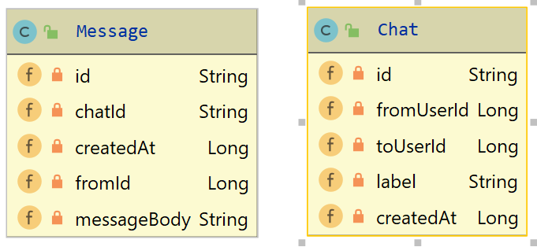
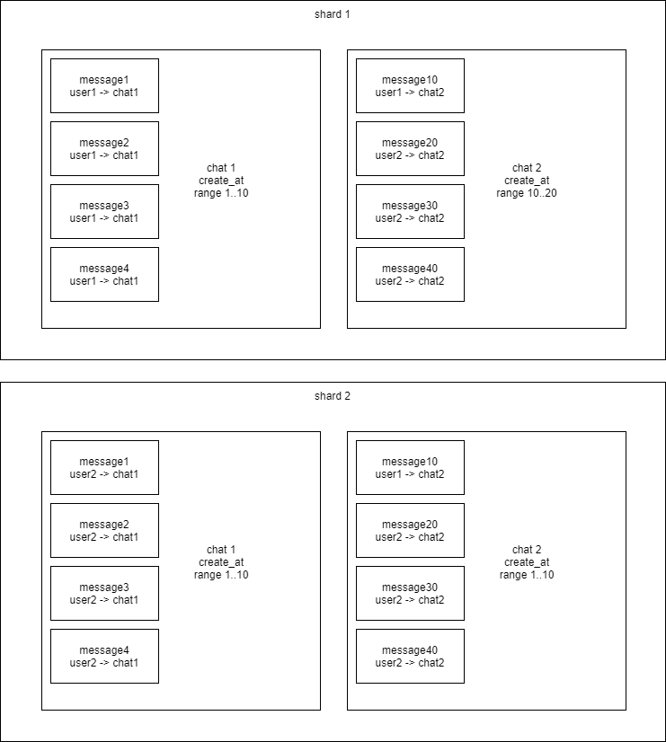

# Отчет "Масштабируемый микросервис диалогов"

Исходный код микросервиса диалогов [здесь](/dialogs-service).

## Модель данных



Сообщения связаны с чатами связью один-к-одному. 
было заложено, что могут быть групповые чаты, поэтому добавлена сущность (документ) чат
(пока в чате могут участвовать только два человека, но планируется расширить).

Чат содержит в себе название, список пользователей чата. Чатов по-идее не должно быть много,
поэтому их можно не шардировать.

Сообщения содержат в себе id-пользователя, написавшего это сообщение, 
id-чата, к которому оно относится, timestamp времени создания и сам текст сообщения.
Сообщения шардируются **по человеку, который их написал** и **по времени написания** (timestamp), 
чтобы учесть “Эффект Леди Гаги”. 
Исходил из следующих соображений: так как timestamp - монотонная последовательность, 
то ему лучше подходит hashed ключ шардирования. Сообщения, написанные одним пользователем, будут лежать рядом,
но в зависимости от timestamp-а на разных шардах (т.е. даже если пользователь пишет 100500 сообщений в секунду,
запись будет происходить равномерно на разные шарды).

Шардирование происходит (примерно) следующим образом:




## Выбор DB

Для шардирования рассматривались следующие варианты:
- JDBC Sharding Driver (with PostgreSQL/MySQL)
- ProxySQL, Vitess
- PostgreSQL Foreign Data Wrapper
- MongoDB
- CoucheDB, Cassandra

Была выбрана NoSQL база данных **MongoDB**.
Запускается с помощью docker-compose файла (https://github.com/chefsplate/mongo-shard-docker-compose).

Краткая инструкция по запуску:
1. Поднять кластер mongoDB в докере.
2. Создать базу данных **social_network**.
3. Включить шардинг для базы данных **social_network**.
4. Создать индекс по полям, входящим в ключ шардирования (fromId и dateCreated).
5. Включить шардинг для коллекции **message**.

### JDBC Sharding Driver (на стороне приложения)

Наиболее гибкий и удобный проект: 
[ShardingSphere - Distributed Database Middleware Ecosphere](https://github.com/apache/shardingsphere).


Проект содержит две ключевые библиотеки, которые можно использовать: **sharding-jdbc** и **sharding-jdbc-spring-boot-starter**.
Поскольку в сервисе диалогов используется spring-boot, то был выбран spring-boot стартер.

Подключение библиотек в maven:

```xml
    <dependencies>
        <dependency>
            <groupId>io.shardingsphere</groupId>
            <artifactId>sharding-jdbc</artifactId>
            <version>3.1.0</version>
            <type>pom</type>
        </dependency>

        <dependency>
            <groupId>io.shardingsphere</groupId>
            <artifactId>sharding-jdbc-spring-boot-starter</artifactId>
            <version>3.1.0</version>
        </dependency>
    </dependencies>
```

Недостатки:
- все настройки (какие данные и на какой узел пойдут) выполняются ручками в коде. 
Алгоритм шардирования тоже нужно реализовывать.
- больно решардить

Преимущества:
- подходит практически для любого типа БД

### ProxySQL, Vitess

todo: попробовать настроить (субъективно не очень понятно, как настраивать ProxySQL и 
не получилось запустить Vitess) 

### PostgreSQL Foreign Data Wrapper
интересно будет попробовать, но вроде почти также удобно как mongodb

### MongoDB

В MongoDB шардирование идет из коробки. Давно хотел попробовать использовать mongo,
но на мой взгляд для высоко нагруженного проекта больше подходит Cassandra.

Недостатки:
- не в полной мере реализован ACID (но для данного сервиса диалогов он особо и не нужен)
- возможны проблемы со сложными join-ами (в сервисе диалогов не используются)

Преимущества:
- шардирование идет из коробки
- также есть репликация
- можно использовать составные ключи шардирования
- процесс балансировки идет в фоне (есть из коробки):
https://docs.mongodb.com/manual/core/sharding-balancer-administration/

### CoucheDB, Cassandra

Шардирование идет из коробки, но происходит автоматически. Теоретически можно настроить, 
но сложнее чем в mongodb.

## Процесс решардинга

Процедура решардинга происходит с помощью внутреннего процесса mongodb, который называется balancer
(https://docs.mongodb.com/manual/core/sharding-balancer-administration/#sharding-balancing).

Перенос чанков между шардами обычно происходит автоматически:


Но также можно вручную перенести данные (в документации не рекомендуют так делать) с
помощью команды:

```js
db.adminCommand( { moveChunk : "social_network.chat",
                   find : {from_id : "123456", date_created : "1234567890"},
                   to : "mongodb-shard3.example.net" } )
```

Добавление шардов в кластер описано здесь:
https://docs.mongodb.com/manual/tutorial/add-shards-to-shard-cluster/

Процесс удаления шардов из кластера описан в документации здесь:
https://docs.mongodb.com/manual/tutorial/remove-shards-from-cluster/

